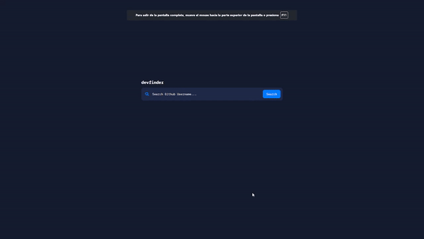

# Vue GitHub Users

This is my first VueJS project, the website was made following [Escuela Vue](https://escuelavue.es) Vue Course using the Github user API.

The took the style from a [FrontendMentor](https://www.frontendmentor.io/) Challenge named [GitHub user search app](https://www.frontendmentor.io/challenges/github-user-search-app-Q09YOgaH6).
But as in the course we added an extra functionality, favorite profiles, i made my own style in that one.

The website is not fully responsive, so make sure you test it out in desktop or >550px device (And i'm not planning making it responsive as it was a practice, but who knows).

## Live Demo

[https://johansantana.github.io/vue-github-users/](https://johansantana.github.io/vue-github-users/)

Icons from [FontAwesome](https://fontawesome.com)
